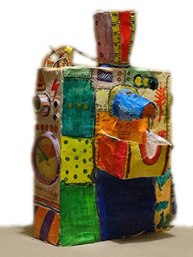
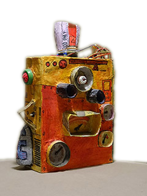

This Arduino-based and *papier-maché* robot will distribute candies during birthday parties.  

**Approach your hand** from the detector on the right side, the robot will emit some D2R2-like blips and a candy will roll down to the basket.  

With the **rear button**, you can choose different colors for the side light.  

[All pictures](webpages/pictures)...

## Tuning

Maintain your hand *during 1 second* very close of the detector (1 to 4 cm), and the robot will enter in the ***adjustment mode***. The motor will turn slowly until it reach its correct initial position.
You can adjust the rotation speed with the rear button.

# Technical data

[List of Materials](webpages/bill_of_material)

[Pinout](webpages/pinout)

## Installation

Upload the sketch into an Arduino Uno board.   
Supply 9v power (necessary for the RGB Led. 5v supply from USB cable is not enough).  
Fill the tank with round shaped candies.

# Credits

Many thanks to the authors of the external libraries used for this project:  
* **Arduino** at [arduino.cc](https://www.arduino.cc)
* **MelodyUtils** by Dave Tucker (from Dave's Arduino Utilities) . *Ornaments and articulations for beautiful Arduino melodies*.
* **NewPing Library** by Tim Eckel to deal with ultrasonic sensors. More information on his [Bitbucket project page]( https://bitbucket.org/teckel12/arduino-new-ping/wiki/Home)
* **NewTone Library** by Tim Eckel for playing sound on an Arduino. More information on his [Bitbucket project page](https://bitbucket.org/teckel12/arduino-new-tone/wiki/Home)

